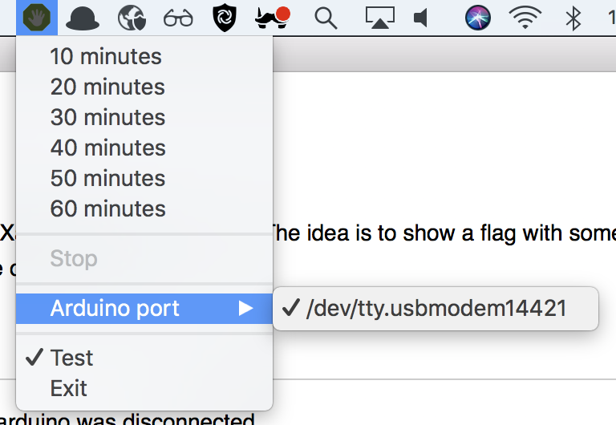

# DoNotDisturbMe

A combination of a MacOS App (with Xamarin) and an Arduino. The idea is to show a flag with something like "Do Not Disturb" so my colleagues can see I am in the middle of something. 

## Current prototype

## First test

## TODO

- Automatically connect to an Arduino on start
- Reconnect to Arduino when the arduino was disconnected
- Add about window
- Connect to Do Not Disturb me on mac (https://stackoverflow.com/questions/25210120/is-it-possible-to-turn-on-off-do-not-disturb-for-os-x-programmatically)

White: 5v (Red Servo)
Blue: Gnd (Brown Servo)
Orange: ~9 (Orange Servo)